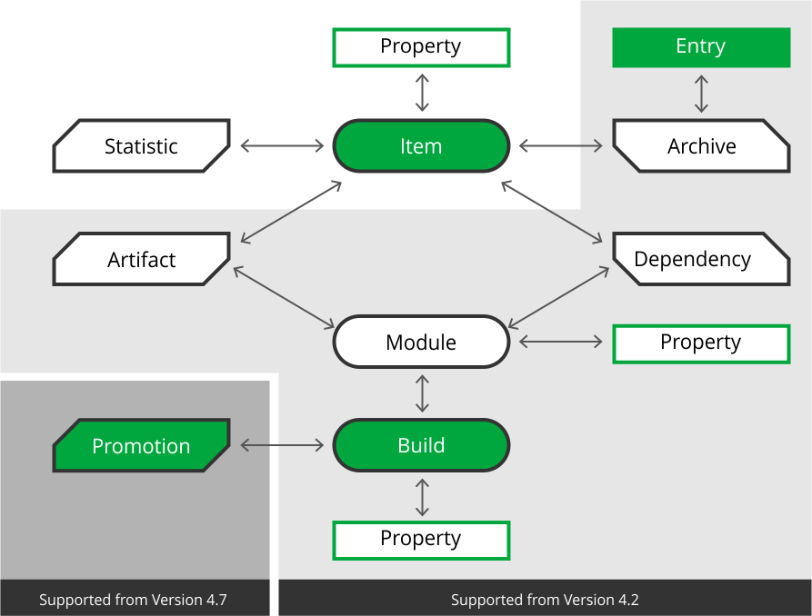

# AQL searches

Keeping track on a tens of thousands of artifacts is not easy, and even if you got some different search functionalities in the UI, you will need to search programmatically as well.

For that, JFrog provides their Artifactory Query Language, AQL. It gives you a way of searching for artifacts based upon meta-data as well as the directory structure.

In order to use these exercises, you either need the jfrog CLI, or use the REST API. All examples here utilizes the REST API.

## Resources

### `curl` and https://www.jfrog.com/confluence/display/RTF/Artifactory+REST+API
`curl` is available as part of the `bash` installation, so no further actions needed.

### `jfrog.exe` tool (optional and not part of the exercises)
* Download: It can be download from [here](https://jfrog.com/getcli/)
* Help: `jfrog.exe help` or https://www.jfrog.com/confluence/display/CLI/JFrog+CLI and https://www.jfrog.com/confluence/display/CLI/CLI+for+JFrog+Artifactory -> "Searching Files"
* NOTE: There is a difference between `jfrog.exe` and `REST API(curl)` in the way items are queried and different abilities in output etc.

### AQL reference
Link to JFrogs own AQL documentation can be found [here](https://www.jfrog.com/confluence/display/RTF/Artifactory+Query+Language#ArtifactoryQueryLanguage-Usage)

### File Spec reference
https://www.jfrog.com/confluence/display/CLI/CLI+for+JFrog+Artifactory#CLIforJFrogArtifactory-UsingFileSpecs

These are the two models that can be used:<br>
1. Full JSON (both `REST API(curl)` and `jfrog.exe`):<br>
```
{
  "files": [
    {
      "aql": {
        "items.find": {
                "repo": "<my_repo>"
        }
      }
    }
  ]
}
```
2. AQL with json (_only_ `REST API(curl)`)
```
items.find(
    {
        "repo": "<my_repo>"
    }
)
```
3. Search path (_only_ `jfrog.exe`)
It is a search option for `jfrog.exe` tool. Example: `jfrog rt s "frog-repo/rabbit/*.zip"`. For details
https://www.jfrog.com/confluence/display/CLI/CLI+for+JFrog+Artifactory#CLIforJFrogArtifactory-SearchingFiles

## Domain model

The AQL domain model is comprised of several entry entities in green, and their corresponding relational entities.



Entry entities are the ones you can base your AQL upon.

So e.g. if you want to query a specific property of an item, you have to go through `item` and then `property` (the `@` notation) to find it.

example:

```json
items.find(
    {
    "type":"file",
    "@os":"windows"
    }
)
```

> **Note:** Users without admin privileges can only issue searches through **item** and must have the following fields included in the search: `name`,`repo`, and `path`.

When using AQL from curl, the query itself is best stored in a plaintext document on the side and used like the command below:

```curl -i -X POST -H "$AUTH_HEADER"  -H "Content-Type:text/plain" $ARTIFACTORY_URL/api/search/aql -T payload.json```

After executing the setup script, you will see four local repositories, each with different maturity denoted:

* `${KATA_USERNAME}-gradle-sandbox-local`
* `${KATA_USERNAME}-gradle-dev-local`
* `${KATA_USERNAME}-gradle-v3-local`
* `${KATA_USERNAME}-gradle-release-local`

## Task

Make queries that does the following:

* Get all artifacts in the Artifactory instance

For the next exercises, we need to limit our searches to your own repositories. You can do that in two ways:

* By using the `$match` keyword to enable wildcards:

```Json
"repo":{"$match":"<KATA_USERNAME>-*"}
```

* By listing all the repositories that needs to be searched with the `$or` keyword:

```Json
"$or":[
    {"repo":"<KATA_USERNAME>-gradle-sandbox-local"},
    {"repo":"<KATA_USERNAME>-gradle-dev-local"}
]
```

### Tasks continued

* Get all files in your repositories. The result should be 6 artifacts.
* Get all files that have been downloaded more than 3 times. The result should be 4 artifacts.
* Get all files where the property `os` has the value `linux`. The result should be 2 artifacts.
* Get all files that are over 1 megabyte (in bytes) large. The result should be 2 artifacts.
* Get instances of an artifact that is uploaded later than X days. (this one we have no answer to, because all artifacts have been uploaded within the past minute or two. But have a look at the specification [here](https://www.jfrog.com/confluence/display/RTF/Artifactory+Query+Language#ArtifactoryQueryLanguage-DateandTimeFormat))