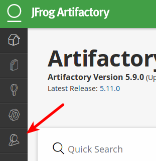
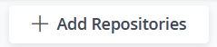
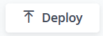
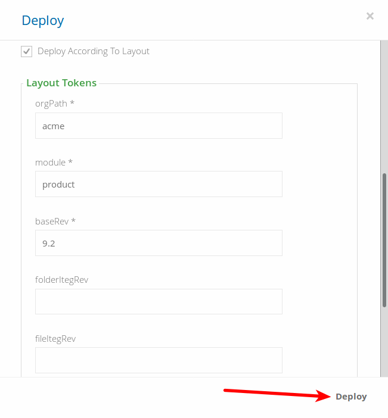
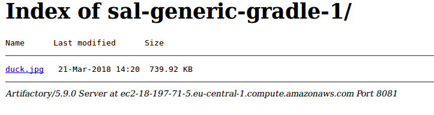

# Create Artifactory repositories and upload files
Run `setup.sh` and note the names of the repositories. These are the names you should use in the exercise.

**The names of your repositories are given when you run `setup.sh`**. _Do not_ invent your own names.

## Create repositories through the UI

* Open the artificatory url in your favorite browser and login

### Create generic repository

1. Navigate to `Admin`-> "Repositories" -> `local`

1. Make two repositories. These should have the Package Type `Generic` and Repository Layout `simple-default`. Name them according to the names you get when you ran `setup.sh`

## Upload some files through the UI

1. Upload `duck.jpg` to the first repository and `fox.jpg` to the 2nd. Remember to tick the `Deploy According To Layout` box and input the mandatory information for the gradle layout. (EXAMPLE: `org: acme, module:duck, baseRev: 1.0.0, ext: jpg`)

## Look at them through the Native browser

The native browser lets you browse the contents of a repository outside of the Artifactory UI.

It provides a highly responsive, read-only view and is similar to a directory listing provided by HTTP servers.

1. Locate the first repository in artifactory UI, and right click --> `native browser` to see `duck.jpg` in the path.

