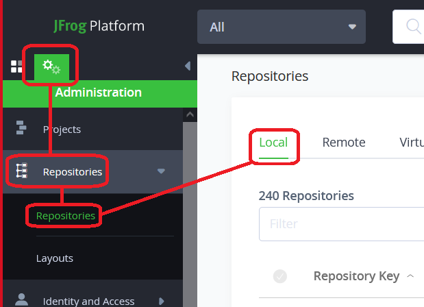

# Create Artifactory repositories and delpoy files

Run `setup.sh` and note the Repository Keys. These are the keys you should use in the exercise.

**The Repository Keys are given when you run `setup.sh`**. _Do not_ invent your own Repository Keys.

## Create repositories through the UI

- Open the artificatory url in your favorite browser and login

### Create generic repository

1. Navigate to `Admin`-> "Repositories" -> `local`

    
    

2. Make two repositories.

    Use:

    - Package Type: `Generic`
    - Repository Key from the output of running `setup.sh`
    - Repository Layout: `simple-default`

## Deploy some files through the UI

1. Deploy the `duck-$KATA_USERNAME.jpg` file from the exercise folder to the first repository, and `fox-$KATA_USERNAME.jpg` to the 2nd. Remember to tick the `Deploy According To Layout` box and input the mandatory information for the gradle layout. (EXAMPLE: `org: acme, module:duck, baseRev: 1.0.0, ext: jpg`)

    
    

## Look at them through the Native browser

The native browser lets you browse the contents of a repository outside of the Artifactory UI.

It provides a highly responsive, read-only view and is similar to a directory listing provided by HTTP servers.

1. Locate the first repository in artifactory UI, and right click --> `native browser` to see `duck.jpg` in the path.

